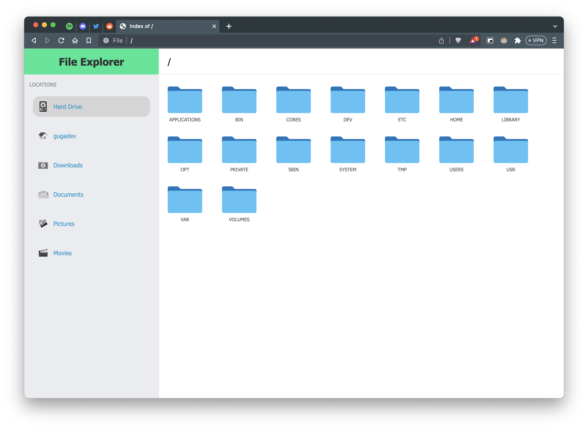

# Better Explorer

Better Explorer is a Chromium extension to tweak the default browser's file explorer.

## Support

It only supports the MacOS file system by now. Sorry, I did this while I was boring. If you want to contribute to bring this extension to Windows / Linux users, feel free to raise a PR!

## How it works

You'll find in the line #1 of the `content.js` script a constant named `username`, **this is your computer username**. That username will be use this to build the following "locations":

- Home folder
- Downloads
- Documents
- Pictures
- Movies

### Why I just don't use FileSystem API?

Well, this a pretty interesting question. The FileSystem API just can be used in a secure context (https), so, given that `file://` isn't a secure context this extension can't use the FS API.

## How can I install this?

If you're a developer, you already know it. If you're a basic user, follow the next steps:

**Download this repository**

Click the "Download" button on the top of this repo. The code will be downloaded as a `.zip`. Extract it in a folder.

**Upload the extension to your browser**

Go to `chrome://extensions/`, `edge://extensions/`, `brave://extensions/` or whatever you're using an enable de **Developer mode** option. You can find this option in the upper right.

Once the *developer mode* is enabled, click on the "Load unpacked" button. This will show you a prompt to choose a folder. Pick the folder where you extracted the `.zip` in the previous step.

That's all. You can go to `file://` in your browser and enjoy the new look.
